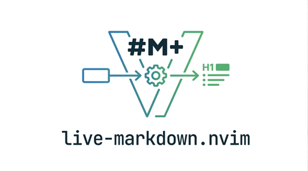
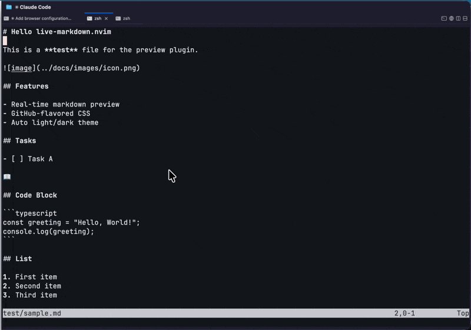

<p align="center">
  
</p>

<h1 align="center">live-markdown.nvim</h1>

<p align="center">Neovim 用リアルタイムマークダウンプレビュー。</p>

<p align="center">
  
</p>

## 特徴

- シングルバイナリ — ランタイム依存なし
- リアルタイムプレビュー + スクロール同期
- シンタックスハイライト（ライト/ダーク自動切替）
- 数式レンダリング（KaTeX）
- Mermaid ダイアグラム対応
- タスクリスト（`- [x]` / `- [ ]`）
- 取り消し線（`~~text~~`）
- ローカル画像プレビュー（相対パス対応）
- GitHub スタイル（ライト/ダーク自動切替）

## インストール

### lazy.nvim

```lua
{
  "bun913/live-markdown.nvim",
  cmd = { "MarkdownPreview", "MarkdownPreviewStop" },
  build = "scripts/install.sh",
  config = function()
    require("live-markdown").setup()
  end,
}
```

カスタムブラウザ起動方式を使う場合:

```lua
{
  "bun913/live-markdown.nvim",
  cmd = { "MarkdownPreview", "MarkdownPreviewStop" },
  build = "scripts/install.sh",
  config = function()
    require("live-markdown").setup({
      browser = {
        strategy = "cmux browser open-split",
      },
    })
  end,
}
```

GitHub Releases からビルド済みバイナリを自動ダウンロードします。ランタイム依存はありません。

## 使い方

```vim
:MarkdownPreview       " プレビューを開く
:MarkdownPreviewStop   " プレビューを閉じる
```

## 設定

```lua
require("live-markdown").setup({
  server = {
    port = 0,            -- 0 = OS が自動割り当て
    host = "localhost",
    binary = nil,        -- コンパイル済みバイナリのパス（nil = bin/live-markdown を自動検出）
  },
  browser = {
    strategy = "auto",   -- "auto" | "open" | "xdg-open" | 任意のコマンド
  },
  render = {
    css = "github-markdown",
    mermaid = true,
  },
  scroll_sync = true,
})
```

### ブラウザ起動方式

| Strategy | 説明 |
|---|---|
| `"auto"` | 自動検出: macOS は `open`、Linux は `xdg-open` |
| `"open"` | macOS デフォルトブラウザ |
| `"xdg-open"` | Linux デフォルトブラウザ |
| 任意の文字列 | シェルコマンドとして実行（URL が末尾に追加される） |

カスタムコマンドの例:

```lua
require("live-markdown").setup({
  browser = {
    strategy = "cmux browser open-split",
  },
})
```

## ライセンス

MIT
