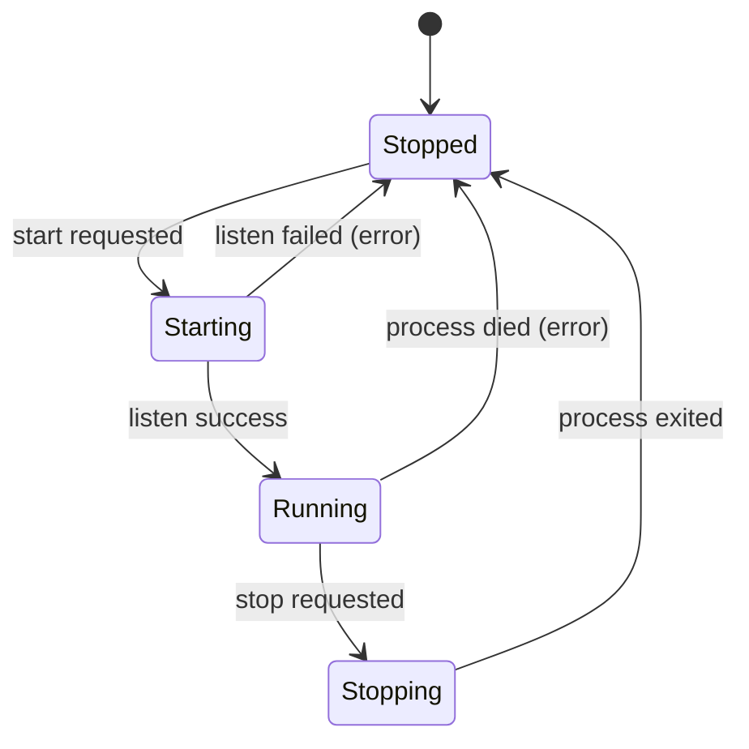
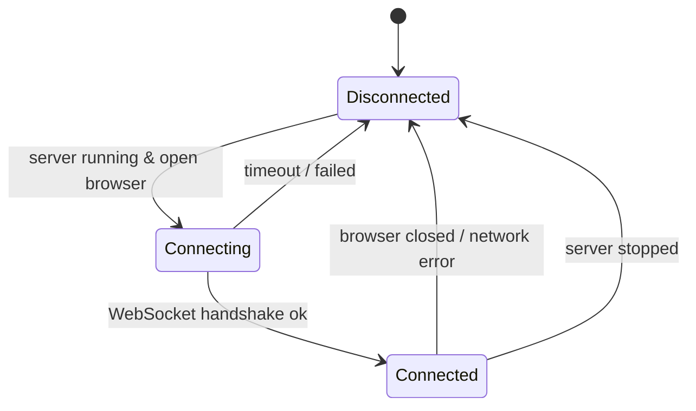
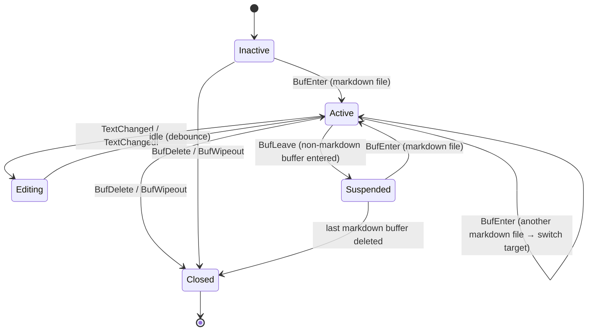
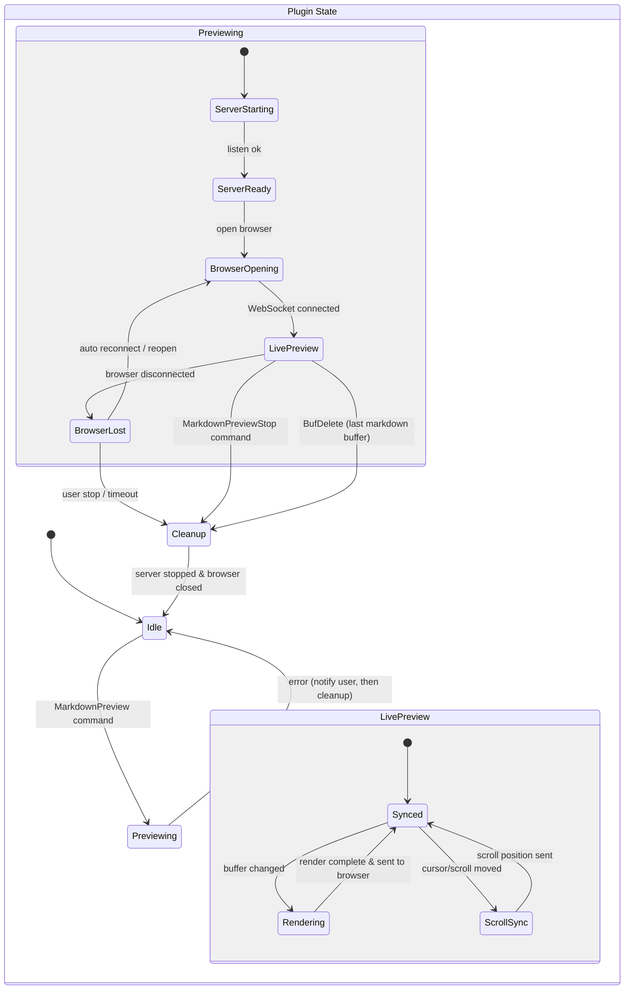

# 状態設計

## 設計方針

mayah「操作より状態・性質に着目する」に従い、操作（コマンド）からではなく状態から設計する。

## 3つのレイヤーの状態

### Server 状態

**Error は状態ではなくイベント（遷移の原因）。**
サーバーがエラーを起こしたら「エラー中」で宙ぶらりんにならず、即座に Stopped に遷移する。
エラー情報はユーザー通知の関心事として別途扱う（後述「エラー通知」参照）。

**実装**: `state.lua` の `valid_transitions.server` テーブルで許可された遷移のみ実行可能。
不正な遷移は `vim.notify()` で ERROR レベル通知され、拒否される。
エラー時は `state.on_error(err)` でサーバー・ブラウザ・バッファすべてのステートを一括リセットする。

### Browser Connection 状態

**実装**: サーバーからの `connected` / `disconnected` メッセージ（stdout JSON Lines）で遷移する。
`browser.open(port)` 呼び出し時に `connecting` に遷移。
接続時にサーバーはキャッシュ済み HTML を即送信し、初回表示を保証する。

### Buffer 状態

**Suspended 状態の性質:**
- プレビューは最後にアクティブだった markdown の表示を維持する
- サーバーは稼働し続ける（再起動のコストを避ける）
- バッファ変更・スクロールの同期は停止する
- markdown バッファに戻れば同期を再開する

**実装**: `buffer.lua` の BufEnter autocmd で filetype を判定。markdown なら `state.set_active_buffer(buf_id)` で対象切り替え、非 markdown なら何もしない（Suspended 相当）。BufDelete / BufWipeout で `close()` を呼ぶ（STEP1 は単一バッファなのでサーバーごと停止）。

## プラグイン全体の複合状態

**実装の流れ** (`init.lua` の `open()`):
1. `server.start(on_ready)` — サーバー起動、`on_ready` コールバックでポート番号を受け取る
2. `browser.open(port)` — ブラウザ起動
3. `buffer.start(buf_id)` — autocmd でバッファ監視開始、初回コンテンツ送信

## 状態から見えるエッジケースと性質

### 性質（常に満たすべき不変条件）
- Server が Stopped なら Browser は必ず Disconnected
- Browser が Connected なら Server は必ず Running
- Buffer が Closed かつ他に markdown バッファがなければ → Cleanup に遷移すべき
- 同時に Running な Server は最大1つ（ポート競合防止）

### エッジケース（状態の組み合わせから自然に発見）
1. **Server Running + Browser Disconnected** → ブラウザが閉じられた。クライアントの自動再接続（exponential backoff, max 10s）でリカバリを試みる
2. **Server Running + Buffer Closed** → 最後のバッファが閉じられた。サーバーを止めるべき
3. **Server Starting + 2回目の start requested** → 二重起動防止が必要（`state.server() ~= "stopped"` でガード済み）

## エラー通知

Error は状態ではなく、Stopped / Idle への遷移を引き起こすイベントとして扱う。
状態をシンプルに保ちつつ、ユーザーへの通知は別の関心事として設計する。

### エラーが起きうるタイミングと通知方法

| タイミング | 原因例 | 遷移 | ユーザー通知 |
|---|---|---|---|
| Server Starting → Stopped | ポート bind 失敗、バイナリ不在 | Idle に戻る | `vim.notify()` でエラーメッセージ |
| Server Running → Stopped | プロセス予期せず終了 | Idle に戻る | `vim.notify()` + プレビューが止まった旨 |
| Browser Connecting → Disconnected | タイムアウト、URL open 失敗 | BrowserLost → リトライ or Cleanup | `vim.notify()` で警告 |

### 設計上のポイント
- エラー状態を持たないことで、状態遷移が常に「正常系」と同じパスを通る
- 「Stopped なのか Error なのか」を気にする if 分岐が不要になる
- エラーの詳細は `vim.notify()` のメッセージとログレベルで表現する
- `state.on_error(err)` で全状態を一括リセット（server, browser, port, job_id, buffer_id）
- 将来的にログファイル出力や `:checkhealth` 対応も可能（状態設計に影響しない）

## 理想像と STEP1

### 理想像（最終形）
- 複数バッファの同時プレビュー対応
- プレビュー側からの編集（双方向同期）
- カスタム CSS / テーマ切り替え UI
- プラグイン設定のホットリロード
- mermaid 以外のダイアグラム（PlantUML, D2 など）

### STEP1（実装済み）
- 単一バッファのプレビュー
- Neovim → ブラウザの片方向同期（編集・スクロール）
- github-markdown-css 固定（CDN 読み込み）
- mermaid.js のみ（クライアント側レンダリング）
- cmux / open / xdg-open / 任意コマンドでのブラウザ起動

### STEP1 でも理想像に向けて整えておく構造
- Server はバッファ ID を受け取る設計にしておく（将来の複数バッファ対応）
- CSS はテンプレートに外部注入する形にしておく（将来のテーマ切替）
- Browser → Server のメッセージ型を types.ts に定義済み（将来の双方向同期）
- ブラウザ起動は strategy パターンで抽象化（プリセット + 任意コマンド文字列）
