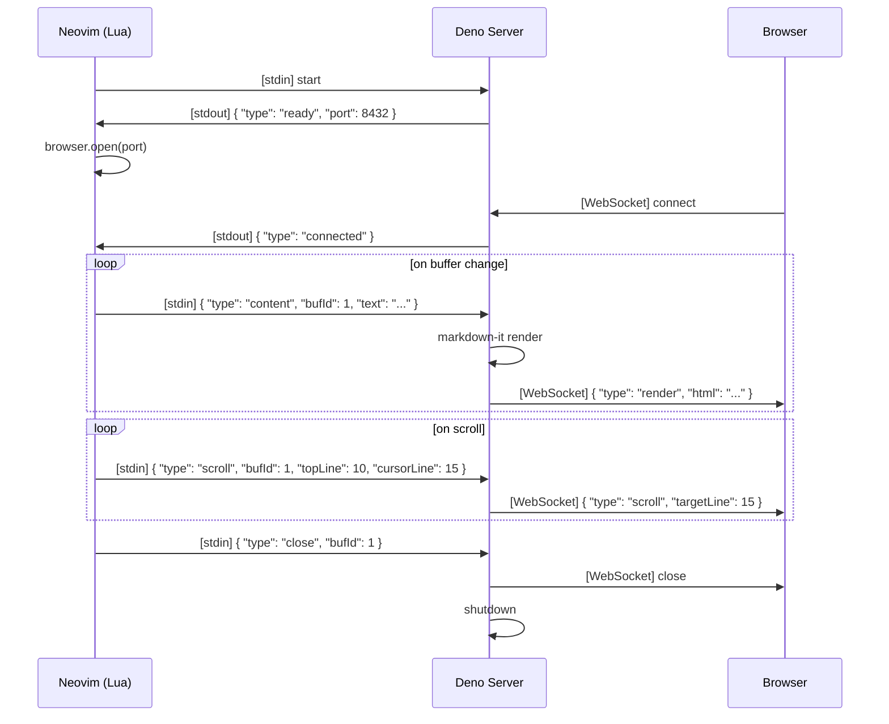

# STEP1 設計

## 設計方針

- 「理想像の STEP1」として設計する。場当たり的な仮実装ではなく、将来の拡張を見据えた構造を持つ
- 「操作より状態」に着目する。コマンドの実装ではなく、状態遷移の正しさを中心に設計する

## ディレクトリ構成

```
live-markdown.nvim/
│
│  # ── Neovim プラグイン側（Lua） ──
├── plugin/
│   └── live-markdown.lua   # エントリーポイント（コマンド定義のみ）
│
├── lua/
│   └── live-markdown/
│       ├── init.lua                # Public API: setup(), open(), close()
│       ├── config.lua              # 設定スキーマとデフォルト値
│       ├── state.lua               # プラグイン状態管理（状態遷移の中心）
│       ├── server.lua              # Deno サーバーの起動・停止・通信
│       ├── browser.lua             # ブラウザ起動 strategy（cmux / open / xdg-open）
│       └── buffer.lua              # バッファ監視（autocmd, 変更検知, スクロール位置）
│
│  # ── Deno サーバー側（TypeScript） ──
├── server/
│   ├── src/
│   │   ├── main.ts                 # サーバーエントリーポイント
│   │   ├── websocket.ts            # WebSocket 接続管理
│   │   ├── renderer.ts             # markdown-it レンダリング（プラガブル設計）
│   │   └── types.ts                # 共有型定義（メッセージプロトコル等）
│   ├── deno.json                   # Deno 設定・依存管理・タスク定義
│   └── deno.lock                   # ロックファイル
│
│  # ── ブラウザ側（HTML/CSS/JS） ──
├── client/
│   ├── index.html                  # プレビュー HTML テンプレート
│   ├── preview.ts                  # WebSocket 受信・DOM 更新・スクロール同期
│   └── mermaid-handler.ts          # mermaid レンダリング（プラガブル）
│
│  # ── ビルド ──
├── scripts/
│   └── build.ts                    # ビルドスクリプト（バンドル・バイナリ生成）
│
│  # ── ドキュメント ──
├── docs/
│   ├── state-design.md             # 状態設計
│   └── step1-design.md             # この文書
│
├── ARCHITECTURE.md                 # 技術スタック概要
├── README.md
├── LICENSE
└── .gitignore
```

## 各モジュールの責務

### Neovim 側 (Lua)

#### `plugin/live-markdown.lua`
- ユーザーコマンドの定義のみ（`:MarkdownPreview`, `:MarkdownPreviewStop`）
- 実際の処理は `require()` で遅延ロード（起動時間に影響しない）

```lua
-- 最小限のエントリーポイント
vim.api.nvim_create_user_command('MarkdownPreview', function()
  require('live-markdown').open()
end, {})

vim.api.nvim_create_user_command('MarkdownPreviewStop', function()
  require('live-markdown').close()
end, {})
```

#### `lua/live-markdown/init.lua`
- Public API: `setup(opts)`, `open()`, `close()`
- 各モジュールのオーケストレーション

#### `lua/live-markdown/config.lua`
- 設定スキーマとデフォルト値の管理
- 将来のテーマ切替・カスタム CSS に備えた構造

```lua
-- デフォルト設定
local defaults = {
  server = {
    port = 0,          -- 0 = 自動割り当て
    host = 'localhost',
  },
  browser = {
    strategy = 'auto', -- 'auto' | 'cmux' | 'open' | 'xdg-open'
  },
  render = {
    css = 'github-markdown', -- 将来: テーマ名 or パス
    mermaid = true,
  },
  scroll_sync = true,
}
```

#### `lua/live-markdown/state.lua`
- **設計の中心**。プラグインの状態遷移を管理
- state-design.md の状態遷移図をコードで表現
- 不正な遷移を防ぐ（例: Server=Stopped なのに open しようとする）

```lua
-- 状態の定義（Error は状態ではなくイベント）
local State = {
  server = 'stopped',       -- stopped | starting | running | stopping
  browser = 'disconnected', -- disconnected | connecting | connected
  buffer_id = nil,          -- 将来の複数バッファ対応に備え ID で管理
}

-- エラーは状態遷移 + vim.notify() で処理
-- 例: server が予期せず死んだ → state.server = 'stopped' + notify
local function on_server_error(err)
  State.server = 'stopped'
  State.browser = 'disconnected'
  vim.notify('[live-markdown] ' .. err, vim.log.levels.ERROR)
end
```

#### `lua/live-markdown/server.lua`
- `vim.fn.jobstart()` で Deno サーバーを起動
- stdin/stdout でプロセス通信
- サーバーの生死監視

#### `lua/live-markdown/browser.lua`
- Strategy パターンでブラウザ起動を抽象化
- `auto`: cmux が使えるか判定 → 使えれば cmux、なければ OS のデフォルト

```lua
local strategies = {
  cmux = function(url)
    vim.fn.system('cmux browser open-split ' .. url)
  end,
  open = function(url)
    vim.fn.system('open ' .. url)
  end,
  ['xdg-open'] = function(url)
    vim.fn.system('xdg-open ' .. url)
  end,
}
```

#### `lua/live-markdown/buffer.lua`
- autocmd でバッファの変更・スクロール・閉じるイベントを監視
- debounce 付きでサーバーにデータ送信
- バッファ切り替え時のプレビュー対象管理

**バッファ切り替え時の挙動:**

| イベント | 挙動 |
|---|---|
| 別の `.md` ファイルを開いた | プレビュー対象を新しいバッファに切り替え、内容を即座に送信 |
| `.md` 以外のファイルを開いた | プレビューは最後の markdown を表示し続ける。同期は一時停止（Suspended） |
| `.md` バッファに戻った | 同期を再開し、現在の内容を送信 |
| 最後の `.md` バッファを閉じた | サーバー停止 → クリーンアップ |

```lua
-- BufEnter で filetype を判定
vim.api.nvim_create_autocmd('BufEnter', {
  callback = function(args)
    local ft = vim.bo[args.buf].filetype
    if ft == 'markdown' then
      -- プレビュー対象を切り替え、同期再開
      state.set_active_buffer(args.buf)
      server.send_content(args.buf)
    else
      -- markdown 以外 → Suspended（プレビューは維持、同期停止）
      state.suspend()
    end
  end,
})
```

### Deno サーバー側 (TypeScript)

#### `server/src/main.ts`
- HTTP サーバー起動（静的ファイル配信 + WebSocket アップグレード）
- stdin から Neovim のメッセージを受信
- ポート番号を stdout で Neovim に返す

#### `server/src/websocket.ts`
- WebSocket 接続の管理
- 接続・切断イベントのハンドリング
- ブラウザへのメッセージ配信

#### `server/src/renderer.ts`
- markdown-it によるレンダリング
- プラガブル設計: ダイアグラムレンダラーを差し替え可能に

```typescript
interface DiagramRenderer {
  name: string;
  test: (code: string, lang: string) => boolean;
  render: (code: string) => string;
}

// STEP1 では mermaid のみ。将来 PlantUML 等を追加可能
const renderers: DiagramRenderer[] = [mermaidRenderer];
```

#### `server/src/types.ts`
- Neovim ↔ Server ↔ Browser 間のメッセージ型定義

```typescript
// Neovim → Server
type NvimMessage =
  | { type: 'content'; bufId: number; text: string }
  | { type: 'scroll'; bufId: number; topLine: number; cursorLine: number }
  | { type: 'close'; bufId: number }

// Server → Browser
type BrowserMessage =
  | { type: 'render'; html: string }
  | { type: 'scroll'; targetLine: number }
```

### ブラウザ側

#### `client/index.html`
- github-markdown-css を適用した HTML テンプレート
- mermaid.js をバンドルとして読み込み
- WebSocket 接続スクリプト

#### `client/preview.ts`
- WebSocket 受信 → DOM 更新
- スクロール同期ロジック（行番号ベース）

#### `client/mermaid-handler.ts`
- mermaid コードブロックの検出とレンダリング
- 将来他のダイアグラムハンドラーを追加する拡張ポイント

## 通信プロトコル



## Neovim ↔ Server 間の通信方式: stdin/stdout（JSON Lines）

Neovim は `jobstart()` で Deno プロセスを起動し、stdin/stdout 経由で JSON Lines（1行1メッセージ）でやりとりする。

**選定理由:**
- WebSocket に比べてシンプル（追加のポートやハンドシェイク不要）
- Neovim の `chansend()` / `on_stdout` で自然に扱える
- peek.nvim も同じ方式を採用

## ビルドとリリース

### 開発時
```bash
# サーバー起動（開発モード）
cd server && deno task dev

# client の TypeScript をバンドル
deno task build:client
```

### リリースビルド
```bash
# client バンドル + サーバーバイナリ生成
deno task build

# プラットフォーム別バイナリ
deno compile --allow-net=localhost --allow-read --output bin/live-markdown-linux-x64 --target x86_64-unknown-linux-gnu server/src/main.ts
deno compile --allow-net=localhost --allow-read --output bin/live-markdown-darwin-arm64 --target aarch64-apple-darwin server/src/main.ts
# ... 他プラットフォーム
```

### GitHub Actions
- tag push → 各プラットフォーム向けバイナリを自動ビルド → Release に添付
- プラグイン初回起動時、Lua 側が適切なバイナリをダウンロード

## プロセスライフサイクルとクリーンアップ

markdown-preview.nvim は `VimLeave` autocmd で `jobstop()` するだけで、サーバー側に親プロセス死活監視がない。
Neovim クラッシュ時に孤児プロセスが残りポートを占有する問題がある。

live-markdown.nvim では3重の防衛線で確実にクリーンアップする。

### 防衛線1: Lua 側 — VimLeavePre autocmd

```lua
-- Neovim 正常終了時
vim.api.nvim_create_autocmd('VimLeavePre', {
  callback = function()
    require('live-markdown').close()
  end,
})
```

### 防衛線2: Deno 側 — stdin EOF 検知

Neovim が終了（正常・異常問わず）すると stdin の pipe が閉じる。
サーバーはこれを検知して自主的にシャットダウンする。

```typescript
// server/src/main.ts
async function watchParent() {
  try {
    // stdin が閉じられるまでブロック
    for await (const _ of Deno.stdin.readable) {
      // メッセージ処理
    }
  } catch {
    // pipe broken
  }
  // ここに来た = Neovim が死んだ → サーバーも終了
  Deno.exit(0);
}
```

### 防衛線3: ポート自動割り当て

`port: 0` でOS にランダムポートを割り当てさせる。
仮にプロセスが残ったとしても、次回起動時にポート競合しない。

```typescript
const server = Deno.serve({ port: 0, hostname: 'localhost' }, handler);
// 実際に割り当てられたポートを Neovim に通知
const port = server.addr.port;
console.log(JSON.stringify({ type: 'ready', port }));
```

### クリーンアップのシナリオ

| シナリオ | 防衛線1 | 防衛線2 | 防衛線3 |
|---|---|---|---|
| `:qa` で正常終了 | ✅ VimLeavePre → jobstop | ✅ stdin EOF | - |
| Neovim クラッシュ / `kill -9` | ❌ autocmd 発火せず | ✅ stdin EOF で終了 | - |
| `:MarkdownPreviewStop` | ✅ 明示的に close() | - | - |
| 最後の markdown バッファを閉じた | ✅ BufDelete → close() | - | - |
| 万が一サーバーが残った場合 | - | - | ✅ ポート競合しない |

## STEP1 の実装優先順

1. **サーバー**: 最小限の HTTP + WebSocket サーバー（markdown-it で HTML 返すだけ）
2. **クライアント**: HTML テンプレート + github-markdown-css + WebSocket 受信→DOM 更新
3. **Lua プラグイン**: jobstart でサーバー起動 → stdin でコンテンツ送信 → ブラウザ起動
4. **スクロール同期**: 行番号ベースの基本的な同期
5. **mermaid**: クライアント側でバンドル済み mermaid.js によるレンダリング
6. **ビルド**: deno compile でバイナリ生成

## 将来の STEP2 以降に向けて STEP1 で仕込む構造

| 将来機能 | STEP1 で仕込む構造 |
|---|---|
| 複数バッファ同時プレビュー | メッセージに `bufId` を含める |
| テーマ切替 | CSS を外部注入可能なテンプレート |
| PlantUML, D2 等 | `DiagramRenderer` インターフェース |
| ブラウザ起動方式の追加 | Strategy パターン |
| 双方向同期 | Browser → Server のメッセージ型を types.ts に定義だけしておく |
