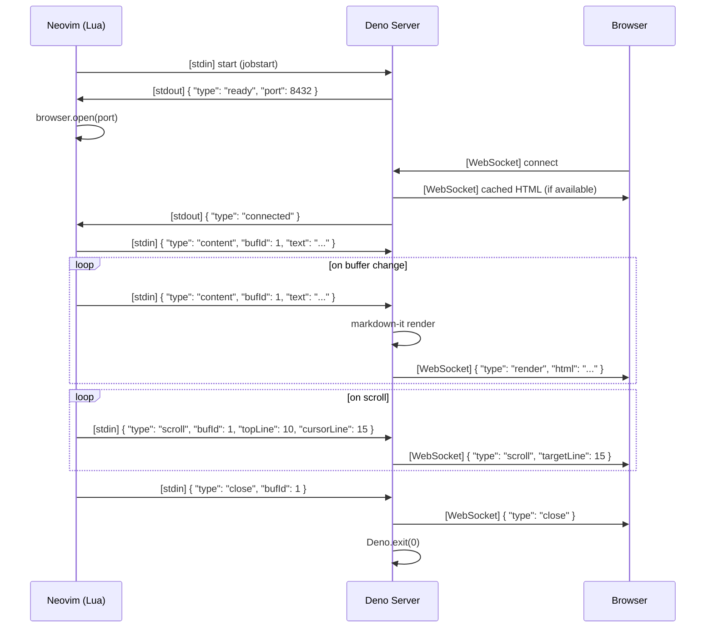

# STEP1 設計

## 設計方針

- 「理想像の STEP1」として設計する。場当たり的な仮実装ではなく、将来の拡張を見据えた構造を持つ
- 「操作より状態」に着目する。コマンドの実装ではなく、状態遷移の正しさを中心に設計する

## 実装ステータス: ✅ 完了

STEP1 のすべてのコンポーネントが実装済み。

## ディレクトリ構成

```
live-markdown.nvim/
│
│  # -- Neovim plugin (Lua) --
├── plugin/
│   └── live-markdown.lua   # Entry point (command definitions only)
│
├── lua/
│   └── live-markdown/
│       ├── init.lua                # Public API: setup(), open(), close()
│       ├── config.lua              # Config schema and defaults
│       ├── state.lua               # Plugin state management (design center)
│       ├── server.lua              # Deno server lifecycle: start, stop, communication
│       ├── browser.lua             # Browser launch strategy (cmux / open / xdg-open / custom)
│       └── buffer.lua              # Buffer watching (autocmd, change detection, scroll)
│
│  # -- Deno server (TypeScript) --
├── server/
│   ├── src/
│   │   ├── main.ts                 # Server entry point (HTTP + WebSocket + stdin reader)
│   │   └── types.ts                # Shared type definitions (message protocol)
│   ├── node_modules/               # npm dependencies (auto-managed by Deno)
│   ├── deno.json                   # Deno config, dependencies, tasks
│   └── deno.lock                   # Lock file for reproducible builds
│
│  # -- Browser client (HTML/CSS/JS) --
├── client/
│   ├── index.html                  # Preview HTML template (github-markdown-css from CDN)
│   └── preview.js                  # WebSocket receive, DOM update, scroll sync, mermaid
│
│  # -- Test --
├── test/
│   └── init.lua                    # Minimal Neovim config for manual testing
│
│  # -- Documentation --
├── docs/
│   ├── state-design.md             # State design
│   └── step1-design.md             # This document
│
├── CLAUDE.md                       # Development guide for Claude Code
├── ARCHITECTURE.md                 # Architecture overview
└── .gitignore
```

### 設計時の構想と実装の差異

- `server/src/websocket.ts` → `main.ts` に統合（WebSocket 管理はシンプルなため分離不要）
- `server/src/renderer.ts` → `main.ts` に統合（markdown-it セットアップとレンダリング）
- `client/preview.ts` → `preview.js` として実装（TypeScript バンドル不要、vanilla JS）
- `client/mermaid-handler.ts` → `preview.js` に統合（mermaid レンダリングロジック）
- `scripts/build.ts` → `deno.json` の tasks で定義（`deno task build`）

## 各モジュールの責務

### Neovim 側 (Lua)

#### `plugin/live-markdown.lua` ✅
- ユーザーコマンドの定義のみ（`:MarkdownPreview`, `:MarkdownPreviewStop`）
- 実際の処理は `require()` で遅延ロード（起動時間に影響しない）

```lua
-- Minimal entry point
vim.api.nvim_create_user_command('MarkdownPreview', function()
  require('live-markdown').open()
end, {})

vim.api.nvim_create_user_command('MarkdownPreviewStop', function()
  require('live-markdown').close()
end, {})
```

#### `lua/live-markdown/init.lua` ✅
- Public API: `setup(opts)`, `open()`, `close()`
- 各モジュールのオーケストレーション
- VimLeavePre autocmd による防衛線1の設定（`setup()` 内）

#### `lua/live-markdown/config.lua` ✅
- 設定スキーマとデフォルト値の管理
- `vim.tbl_deep_extend("force", defaults, opts)` でユーザー設定をマージ

```lua
-- Default config
local defaults = {
  server = {
    port = 0,          -- 0 = OS auto-assigns
    host = 'localhost',
  },
  browser = {
    strategy = 'auto', -- 'auto' | 'cmux' | 'open' | 'xdg-open' | custom command string
  },
  render = {
    css = 'github-markdown', -- future: theme name or path
    mermaid = true,
  },
  scroll_sync = true,
}
```

#### `lua/live-markdown/state.lua` ✅
- **設計の中心**。プラグインの状態遷移を管理
- state-design.md の状態遷移図をコードで表現
- 不正な遷移を防ぐ（`valid_transitions` テーブルで許可された遷移のみ実行可能）
- `on_error(err)`: 全状態を一括リセット + `vim.notify()` で通知
- `reset()`: クリーンアップ完了時の全状態リセット

```lua
-- State definition (Error is not a state but an event)
local state = {
  server = 'stopped',       -- stopped | starting | running | stopping
  browser = 'disconnected', -- disconnected | connecting | connected
  buffer_id = nil,          -- managed by ID for future multi-buffer support
  port = nil,
  job_id = nil,
}
```

#### `lua/live-markdown/server.lua` ✅
- `vim.fn.jobstart()` で Deno サーバーを起動（`deno run --allow-net=localhost --allow-read`）
- stdin/stdout でプロセス通信（JSON Lines）
- stdout の JSON パース: バッファリングして完全な JSON オブジェクトを検出
- `on_exit` コールバックでプロセス死活監視
- `send_content(buf_id)`: バッファ全文を送信
- `send_scroll(buf_id)`: カーソル位置 + topline を送信
- `connected` メッセージ受信時にアクティブバッファの内容を再送信（初回表示保証）

#### `lua/live-markdown/browser.lua` ✅
- Strategy パターンでブラウザ起動を抽象化
- `auto`: cmux が使えるか判定 → 使えれば cmux、macOS なら open、その他は xdg-open
- プリセットにないコマンド文字列はそのまま実行（`strategy_name .. " " .. shellescape(url)`）

```lua
local strategies = {
  cmux = function(url)
    vim.fn.system('cmux browser open-split ' .. vim.fn.shellescape(url))
  end,
  open = function(url)
    vim.fn.system('open ' .. vim.fn.shellescape(url))
  end,
  ['xdg-open'] = function(url)
    vim.fn.system('xdg-open ' .. vim.fn.shellescape(url))
  end,
}
-- If strategy_name is not in the table, treated as a custom command string
```

#### `lua/live-markdown/buffer.lua` ✅
- autocmd でバッファの変更・スクロール・閉じるイベントを監視
- `LiveMarkdown` augroup で管理（`stop()` 時に一括削除）
- バッファ切り替え時に新しいバッファにも TextChanged autocmd を追加
- BufDelete / BufWipeout で `close()` 呼び出し（STEP1: 単一バッファなのでサーバーごと停止）

**バッファ切り替え時の挙動:**

| イベント | 挙動 |
|---|---|
| 別の `.md` ファイルを開いた | プレビュー対象を新しいバッファに切り替え、内容を即座に送信 |
| `.md` 以外のファイルを開いた | プレビューは最後の markdown を表示し続ける。同期は一時停止（Suspended） |
| `.md` バッファに戻った | 同期を再開し、現在の内容を送信 |
| 最後の `.md` バッファを閉じた | サーバー停止 → クリーンアップ |

### Deno サーバー側 (TypeScript)

#### `server/src/main.ts` ✅
- HTTP サーバー起動（`Deno.serve({ port: 0, hostname: "localhost" })`）
- 静的ファイル配信: client/ ディレクトリ + `/vendor/mermaid.min.js`（node_modules から）
- WebSocket アップグレード + 接続管理（`Set<WebSocket>`）
- stdin から JSON Lines を読み取り、メッセージを処理
- markdown-it によるレンダリング + `data-source-line` 属性注入
- 最後にレンダリングした HTML をキャッシュし、新規 WebSocket 接続時に即送信
- stdin EOF 検知で自動シャットダウン（防衛線2）
- サーバー終了時にブラウザへ `close` メッセージ送信

**`data-source-line` 注入の実装詳細:**
- heading_open, paragraph_open, bullet_list_open, ordered_list_open, blockquote_open, code_block, hr, table_open: `token.attrSet()` で属性を設定
- fence: デフォルトレンダラーの出力（`<pre><code class="language-xxx">`）を保持しつつ、`<pre>` タグに `data-source-line` を文字列置換で注入

#### `server/src/types.ts` ✅
- Neovim ↔ Server ↔ Browser 間のメッセージ型定義

```typescript
// Neovim -> Server (stdin, JSON Lines)
type NvimMessage =
  | { type: 'content'; bufId: number; text: string }
  | { type: 'scroll'; bufId: number; topLine: number; cursorLine: number }
  | { type: 'close'; bufId: number }

// Server -> Browser (WebSocket)
type BrowserMessage =
  | { type: 'render'; html: string }
  | { type: 'scroll'; targetLine: number }
  | { type: 'close' }

// Server -> Neovim (stdout, JSON Lines)
type ServerMessage =
  | { type: 'ready'; port: number }
  | { type: 'connected' }
  | { type: 'disconnected' }

// Browser -> Server (WebSocket) - defined ahead for future bidirectional sync
type BrowserToServerMessage =
  | { type: 'scroll'; targetLine: number }
```

### ブラウザ側

#### `client/index.html` ✅
- github-markdown-css を CDN（cdnjs 5.8.1）から読み込み
- `<body class="markdown-body">` で GitHub スタイル適用
- ダーク/ライトモード自動対応（`prefers-color-scheme: dark`）
- `/vendor/mermaid.min.js` を読み込み（`startOnLoad: false` で初期化）
- `/preview.js` を読み込み

#### `client/preview.js` ✅
- vanilla JavaScript（TypeScript ビルド不要）、即時関数で実装
- WebSocket 受信 → DOM 更新（`contentEl.innerHTML = msg.html`）
- mermaid レンダリング: `code.language-mermaid` を検出 → `<div class="mermaid">` に置換 → `mermaid.run()` で描画
- スクロール同期: `data-source-line` 属性を走査し `scrollIntoView()` で移動
- 自動再接続: exponential backoff（初期 1s、最大 10s）
- `close` メッセージ受信時: `window.close()` を試み、失敗時は「Preview stopped」メッセージ表示

## 通信プロトコル ✅



## Neovim ↔ Server 間の通信方式: stdin/stdout（JSON Lines）✅

Neovim は `jobstart()` で Deno プロセスを起動し、stdin/stdout 経由で JSON Lines（1行1メッセージ）でやりとりする。

**選定理由:**
- WebSocket に比べてシンプル（追加のポートやハンドシェイク不要）
- Neovim の `chansend()` / `on_stdout` で自然に扱える
- peek.nvim も同じ方式を採用

## ビルドとリリース

### 開発時 ✅
```bash
# Start server in dev mode
cd server && deno task dev
```

### リリースビルド ✅
```bash
# Build binary (includes client/ files)
cd server && deno task build
# Equivalent to:
# deno compile --allow-net=localhost --allow-read --include ../client/ --output ../bin/live-markdown src/main.ts
```

### マニュアルテスト ✅
```bash
# Launch Neovim with test config
nvim -u test/init.lua test/sample.md
# Then run :MarkdownPreview
```

### GitHub Actions（未実装）
- tag push → 各プラットフォーム向けバイナリを自動ビルド → Release に添付
- プラグイン初回起動時、Lua 側が適切なバイナリをダウンロード

## プロセスライフサイクルとクリーンアップ ✅

markdown-preview.nvim は `VimLeave` autocmd で `jobstop()` するだけで、サーバー側に親プロセス死活監視がない。
Neovim クラッシュ時に孤児プロセスが残りポートを占有する問題がある。

live-markdown.nvim では3重の防衛線で確実にクリーンアップする。

### 防衛線1: Lua 側 — VimLeavePre autocmd ✅

```lua
-- init.lua setup() 内で登録
vim.api.nvim_create_autocmd('VimLeavePre', {
  callback = function()
    require('live-markdown').close()
  end,
})
```

### 防衛線2: Deno 側 — stdin EOF 検知 ✅

Neovim が終了（正常・異常問わず）すると stdin の pipe が閉じる。
サーバーはこれを検知して自主的にシャットダウンする。
終了前にブラウザへ `close` メッセージを送信し、ブラウザタブの自動クローズを試みる。

```typescript
// server/src/main.ts readStdin()
// stdin が閉じられるまで JSON Lines を読み取り
// EOF に達したら broadcast({ type: "close" }) + Deno.exit(0)
```

### 防衛線3: ポート自動割り当て ✅

`port: 0` でOS にランダムポートを割り当てさせる。
仮にプロセスが残ったとしても、次回起動時にポート競合しない。

```typescript
const server = Deno.serve({ port: 0, hostname: 'localhost' }, handler);
const port = server.addr.port;
notifyNeovim({ type: 'ready', port });
```

### クリーンアップのシナリオ

| シナリオ | 防衛線1 | 防衛線2 | 防衛線3 |
|---|---|---|---|
| `:qa` で正常終了 | ✅ VimLeavePre → close() → jobstop | ✅ stdin EOF | - |
| Neovim クラッシュ / `kill -9` | ❌ autocmd 発火せず | ✅ stdin EOF で終了 | - |
| `:MarkdownPreviewStop` | ✅ 明示的に close() | - | - |
| 最後の markdown バッファを閉じた | ✅ BufDelete → close() | - | - |
| 万が一サーバーが残った場合 | - | - | ✅ ポート競合しない |

## STEP1 の実装優先順（✅ 全完了）

1. **サーバー**: 最小限の HTTP + WebSocket サーバー（markdown-it で HTML 返すだけ）✅
2. **クライアント**: HTML テンプレート + github-markdown-css + WebSocket 受信→DOM 更新 ✅
3. **Lua プラグイン**: jobstart でサーバー起動 → stdin でコンテンツ送信 → ブラウザ起動 ✅
4. **スクロール同期**: 行番号ベースの基本的な同期 ✅
5. **mermaid**: クライアント側で mermaid.js レンダリング ✅
6. **ビルド**: deno compile でバイナリ生成 ✅

## 将来の STEP2 以降に向けて STEP1 で仕込む構造

| 将来機能 | STEP1 で仕込んだ構造 | 状態 |
|---|---|---|
| 複数バッファ同時プレビュー | メッセージに `bufId` を含めている | ✅ 実装済み |
| テーマ切替 | CSS を CDN 外部読み込み（テンプレートで差し替え可能） | ✅ 実装済み |
| PlantUML, D2 等 | mermaid はクライアント側レンダリング（同様に追加可能） | ✅ 構造あり |
| ブラウザ起動方式の追加 | Strategy パターン + カスタムコマンド文字列対応 | ✅ 実装済み |
| 双方向同期 | Browser → Server のメッセージ型を types.ts に定義済み | ✅ 型定義済み |
| コード構文ハイライト | fence ルールが class 属性を保持している（highlight.js/Shiki 追加可能） | ✅ 構造あり |
