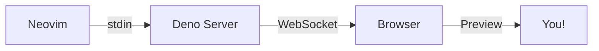

# Hello live-markdown.nvim

This is a **test** file for the preview plugin.

## Features

- Real-time markdown preview
- GitHub-flavored CSS
- Auto light/dark theme

## Code Block

```typescript
const greeting = "Hello, World!";
console.log(greeting);
```

## List

1. First item
2. Second item
3. Third item

## Links

[Neovim](https://neovim.io) is great.

## Mermaid Diagram



---

> Edit this file and watch the preview update in real-time!
