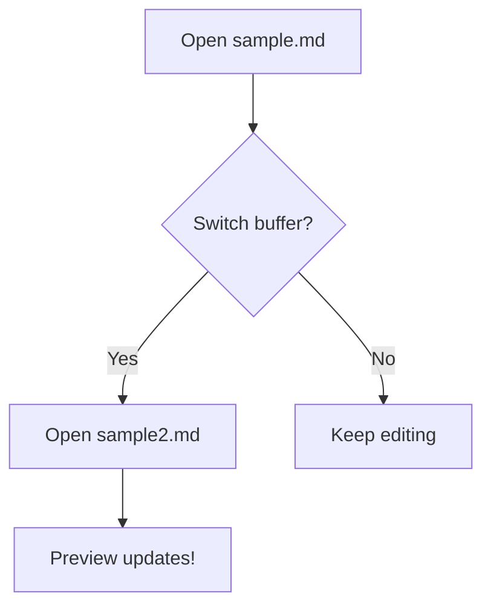

# Second Test File

This is **sample2.md** to test buffer switching.

## Table

| Feature | Status |
|---------|--------|
| Preview | Working |
| Scroll sync | Working |
| Mermaid | Working |
| Buffer switch | Testing now! |

## Mermaid

## Blockquote

> If you see this, buffer switching works.
> Switch back to sample.md and confirm the preview updates.
